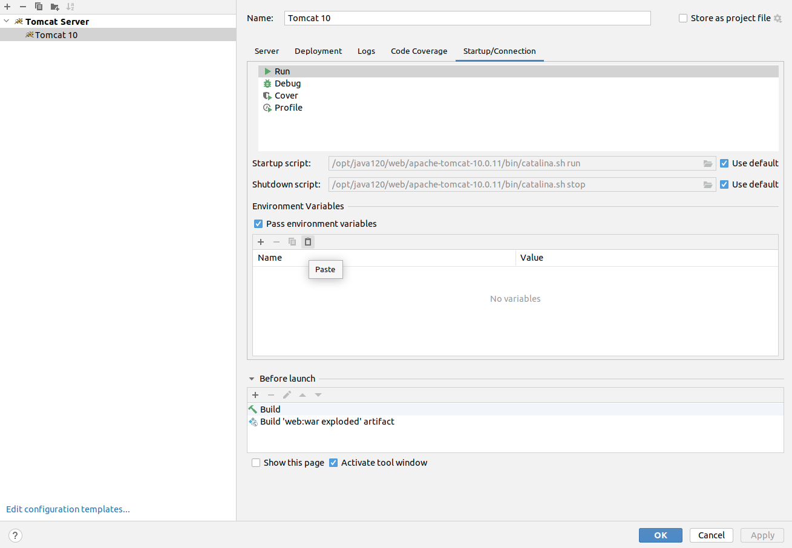

Для подключения к БД в конфигурации запуска (и для Run, и для Debug - они отдельные) добавить следующий:

Добавлять надо URL: `CATALINA_OPTS=-DJDBC_DATABASE_URL="jdbc:postgresql://localhost:5432/db?user=app&password=pass"` (он сам автоматически разобьётся на `Name` и `Value`)

В Docker Compose передавать:

`CATALINA_OPTS=-DJDBC_DATABASE_URL="jdbc:postgresql://db:5432/db?user=app&password=pass"`
